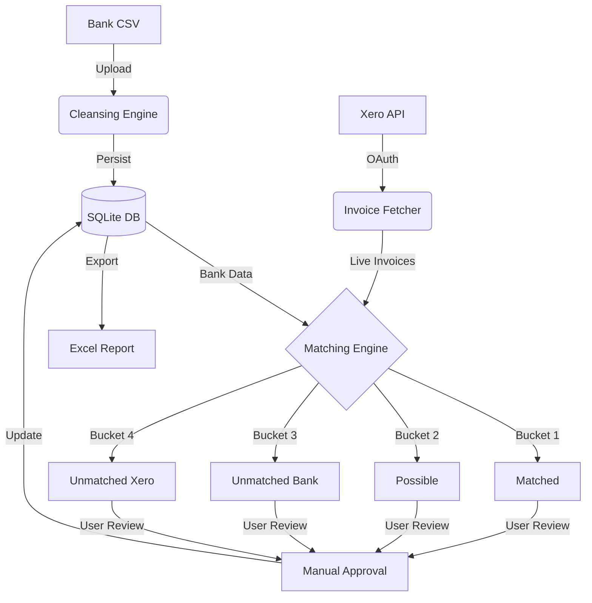

# 💳 BankSync: AI-Powered Reconciliation Engine

**BankSync** is a premium, full-stack financial tool designed to bridge the gap between bank statements and accounting software. It leverages a multi-tier heuristic matching engine to automate the tedious process of reconciliation, providing a "lean-back" interactive experience for financial controllers.

---

## 🚀 Vision & Key Features

*   🤖 **Intelligent 3-Pass Matching**: A deterministic and heuristic engine that categorizes transactions into Matched, Possible, and Unmatched buckets with confidence scores (0-100%).
*   🔗 **Native Xero Integration**: Seamless OAuth 2.0 handshake with real-time invoice fetching and background token rotation.
*   📊 **Professional Reporting**: Export beautiful, multi-sheet Excel reconciliation summaries with full audit trails.
*   🎨 **Modern 3D Interactive UI**: A state-of-the-art interface featuring 3D animated testimonials, radial orbital features, and a high-density full-screen reconciliation workspace.
*   🛡️ **Audit-Ready Actions**: Every manual match is timestamped and stored, ensuring compliance and data integrity.

---

## 🏗️ Tech Stack

| Component | Technology |
| :--- | :--- |
| **Frontend** | React (Vite), Tailwind CSS, Framer Motion, Lucide Icons, Axios |
| **Backend** | FastAPI (Python), SQLAlchemy ORM, SQLite |
| **Integration** | Xero OAuth 2.0 & Accounting API |
| **Reporting** | Pandas, OpenPyXL (Excel Generation) |

---

## ⚙️ Setup Instructions

### 1️⃣ Clone and Navigate
```bash
git clone <repository-url>
cd bank-reconciliation-tool
```

### 2️⃣ Backend Configuration
```bash
cd backend
python -m venv venv
source venv/bin/activate  # Linux/Mac
# OR: venv\Scripts\activate # Windows

pip install -r requirements.txt
pip install pandas openpyxl  # Ensure reporting tools are present
```

**Create a `.env` file in `/backend`:**
```env
XERO_CLIENT_ID=your_id
XERO_CLIENT_SECRET=your_secret
XERO_REDIRECT_URI=http://localhost:8000/auth/callback
DATABASE_URL=sqlite:///./app.db
SECRET_KEY=generate_a_random_string
```

### 3️⃣ Frontend Configuration
```bash
cd ../frontend
npm install
npm run dev
```

---

## 🧠 Core Assumptions

1.  **Source of Truth**: Xero is considered the immutable source of truth for invoices. The tool does not modify Xero data; it only reads and links.
2.  **CSV Schema**: The tool assumes bank statements contain at least `Date`, `Amount`, and `Description`. It uses a fuzzy-matching header extractor to handle different bank formats.
3.  **Local Persistence**: SQLite is used for high-speed local development. It is assumed the app runs in a single-tenant environment for this MVP.
4.  **Transaction Polarity**: It is assumed that bank withdrawals are negative and deposits are positive, though the engine is resilient to basic polarity flips.

---

## ⚠️ Known Limitations

*   **Fuzzy Thresholds**: The "Fuzzy Pass" is capped at a 5-day date window and ±1% amount discrepancy. Extreme outliers require manual matching.
*   **Concurrency**: While background token refreshing is locked, the SQLite backend is not optimized for high-concurrency multi-user writes.
*   **Large Datasets**: Statement uploads >10,000 rows may experience latency in the interactive 4-bucket UI without further pagination optimizations.

---

## 🌊 Data Flow Diagram



---

## 🚀 Future Roadmap (What I'd do differently)

1.  **PostgreSQL Migration**: Move to a robust relational DB like PostgreSQL for production-grade concurrency and performance.
2.  **WebSockets**: Implement real-time status updates so multiple users can see reconciliation progress simultaneously.
3.  **Advanced OCR**: Integrate a service to scan physical receipts and match them directly to "Unmatched Bank" items.
4.  **Dockerization**: Orchestrate the stack with Docker Compose for one-command deployment across any environment.

---

## 👨‍💻 Author
**Sooraj**
*Full Stack Developer | Financial Tech Specialist*
